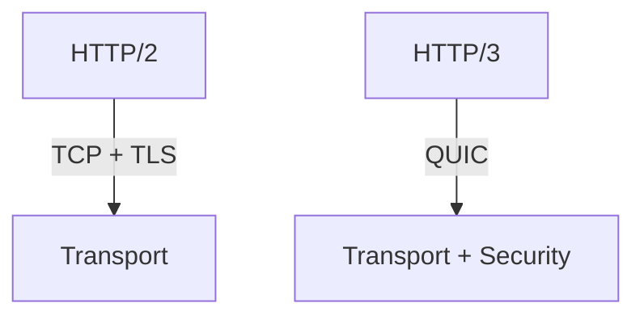

# Understanding HTTP/3: The Future of Web Protocol

HTTP/3 represents a significant evolution in web protocols, building on lessons learned from HTTP/1.1 and HTTP/2.

## Key Features

### QUIC Transport Protocol

HTTP/3 is built on QUIC, which offers several advantages:

1. Built-in encryption
2. Reduced latency
3. Connection migration
4. Multiplexing without head-of-line blocking

## Performance Improvements

Here's a simple Node.js server using HTTP/3:

```javascript
const http3 = require('http3');

const server = http3.createServer((req, res) => {
    res.writeHead(200, { 'Content-Type': 'text/plain' });
    res.end('Hello HTTP/3!');
});

server.listen(443);
```

### Comparison with HTTP/2



## Implementation Considerations

> "HTTP/3 is not just an upgrade, it's a rethinking of how modern web protocols should work." - Daniel Stenberg

### Migration Strategy

1. **Gradual Rollout**
   * Test in staging
   * Monitor metrics
   * Plan fallback options

2. **Infrastructure Updates**
   * Load balancer support
   * Monitoring tools
   * Security configurations

## Browser Support

| Browser | Version | Status |
|---------|---------|---------|
| Chrome | 85+ | Enabled |
| Firefox | 88+ | Enabled |
| Safari | 14+ | Experimental |
| Edge | 85+ | Enabled |

## Looking Ahead

The future of HTTP/3 looks promising, with increasing adoption and support across the web ecosystem.

### Key Takeaways

1. Built on QUIC for better performance
2. Improved mobile experience
3. Better security by default
4. Reduced latency
5. Improved congestion control
